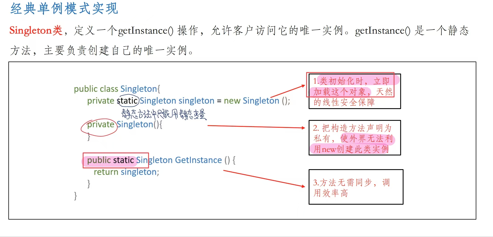
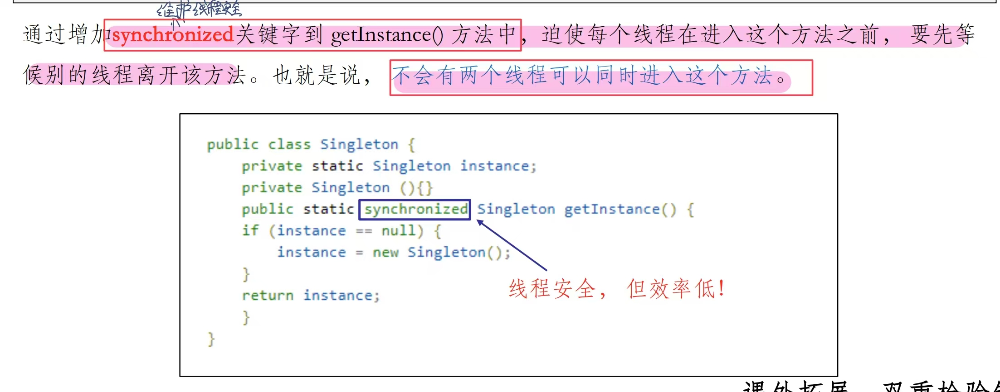
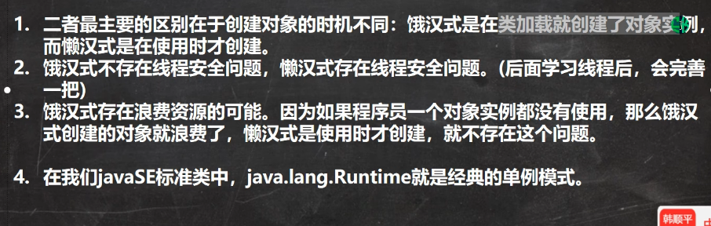

单例模式定义：**保证一个类仅有一个实例，并提供一个访问它的全局访问点**。例如：飞机大战中的英雄机

使用步骤：
1. 将构造器私有化（是外界无法利用new创建此类实例）
2. 类的内部创建对象（该对象时静态的）
3. 向外暴露一个静态的、公共的访问此对象的方法

单例模式分为懒汉式和饿汉式下面分别进行讲解代码实现

### 1）饿汉式

* 饿汉式的意思是比较饥渴，命名为static属性，这样在类初始化时就会加载这个对象、
* 因为第一条，所以饿汉式天然的保证了线程安全
* 提供了一个静态方法`getInstance`，直接返回创建的对象（静态的原因是：如果不静态此方法只能创建对象来调用，那么就达不成单例模式的目的）
* 单例模式创建的对象往往都是重量级的对象，饿汉式可以在调用其他静态变量时（也就是类被加载时就已经创建），但是没有使用，这样造成资源的浪费

### 2）懒汉式

* 懒汉式的意思就是比较懒，在类内部只是声明这个唯一实例，在别人要使用此实例，也就是调用`getInstance`时，才创建此唯一实例，这样不会造成资源浪费
* `getInstance`方法中首先判断声明的引用变量是否为空，为空再创建该对象，否则就是已经创建，直接返回
* 若多线程同时调用`getInstance`方法，则可能会创建多个实例，所以线程不安全

饿汉式的线程安全版本：加同步锁（synchronized）

* 通过synchronized关键字对`getInstance`方法加上同步锁，这样限制每个线程在进入此方法之前，要先等候别的线程离开该方法
* 也就是说不会有两个线程同时进入此方法，线程安全

上面的锁粒度太大，正确的作法在[01JMM的理解](../JVM/07Java内存模型/01JMM的理解.md)

